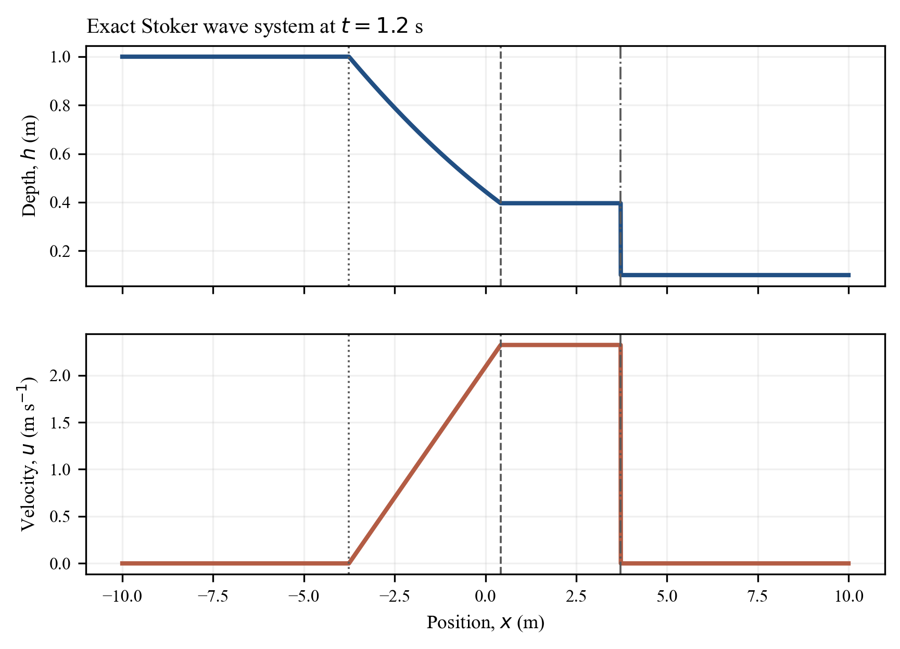
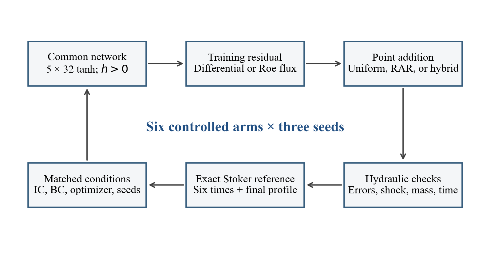
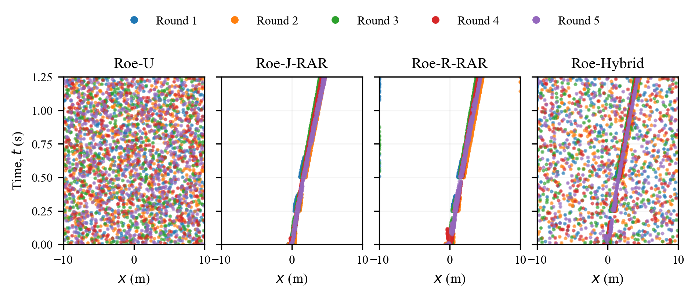
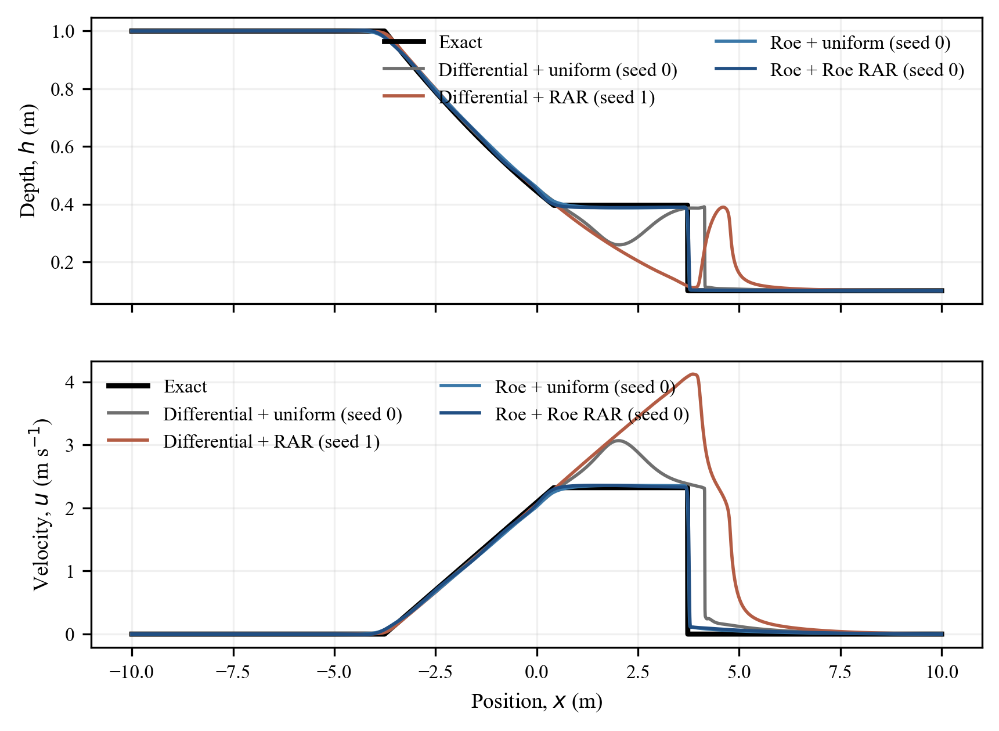
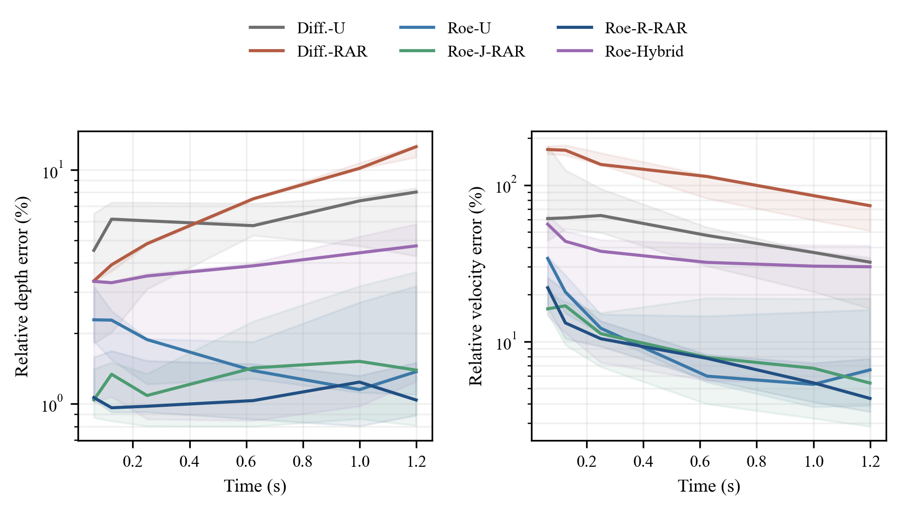
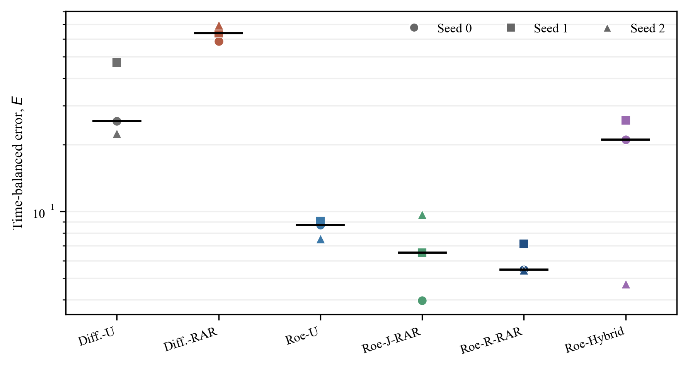
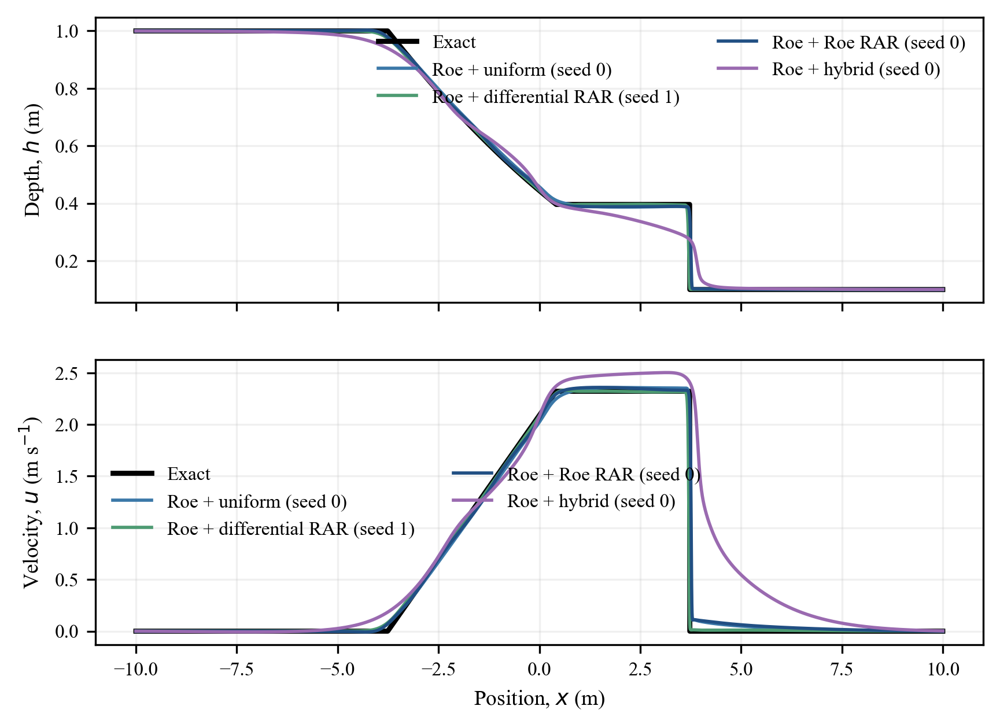
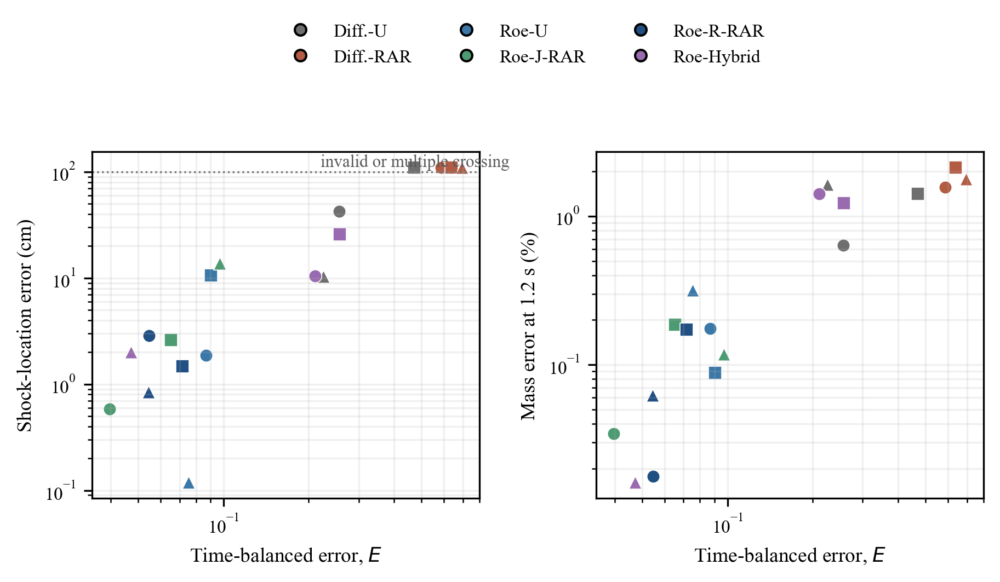

# Roe-flux physics-informed neural networks for wet-bed dam-break flow: a controlled study of residual formulation and adaptive sampling

*Danial Goodarzi and Abdolmajid Mohammadian*  
Department of Civil Engineering, University of Ottawa, Ottawa, Ontario, Canada

## Abstract

Dam-break floods generate rapidly propagating waves that can threaten
downstream communities, infrastructure, and hydraulic structures. Predicting
their arrival time, depth, and velocity requires a model that can represent a
moving shock wave while respecting conservation across the front. This chapter
examines one question: under a fixed architecture and training budget, how do
the spatial residual and the placement of collocation points affect a neural
solution of the Stoker wet-bed dam-break problem? Six configurations cross a
pointwise differential residual or a Roe numerical-flux residual with uniform
enrichment, residual-based adaptive refinement (RAR), and a hybrid sampling
rule. Each configuration is trained from three matched random seeds. All
quantitative results come from the 18 runs contained in `runs.tar.gz`.

The residual formulation is the dominant design choice. With uniform point
enrichment, the Roe residual reduces the time-balanced depth--velocity error by
66.0--80.8% relative to the differential residual for the three paired seeds.
With differential-residual refinement, changing the training residual from the
differential form to the Roe form reduces the same error by 86.0--93.2%. RAR
has a conditional effect. Roe-residual RAR improves every Roe-uniform run, with
a median paired reduction of 27.7%, whereas differential-residual RAR worsens
every differential run and does not produce a unique shock-wave crossing.
The best-performing configuration, Roe training with Roe-residual RAR, gives a
median time-balanced error of 0.0547, final relative errors of 1.04% in depth
and 4.32% in velocity, and valid shock-wave detection in all three runs. These
results support numerical-flux residuals for discontinuous shallow-water
solutions, but they do not support RAR as a residual-independent improvement.

**Keywords:** shallow-water equations; dam-break flow; physics-informed neural
network; Roe flux; residual-based adaptive refinement; shock wave

## 1. Introduction

Dam-break floods are among the most rapid and destructive unsteady flows in
hydraulic engineering. A sudden release of impounded water can produce large
depths, high velocities, and short warning times downstream, placing people,
bridges, roads, buildings, and other critical infrastructure at risk. Reliable
prediction of the flood-wave arrival time and intensity is therefore important
for hazard mapping, emergency planning, dam-safety assessment, and the design
of protective measures [1--4].

The hydraulic response is difficult to calculate because a dam break produces
several wave structures at once. In the idealized wet-bed problem, sudden
removal of the barrier creates a left-going rarefaction wave and a right-going
shock wave, separated by a nearly uniform region of moving water. The shock
position determines when the rapid flow change reaches a downstream location,
while the depth and velocity behind the shock determine the transported
discharge and momentum. A useful model must reproduce all of these quantities,
not only the overall water-surface shape.

The wet-bed dam break is consequently a compact but exacting benchmark for a
transient-flow model. Its rarefaction is smooth, whereas the shock wave is a
discontinuity whose speed and jump are constrained by mass and momentum
conservation. A low average depth error can still conceal an incorrect shock
location or velocity because the upstream reservoir occupies much of the
spatial domain and dominates the depth norm [1--4]. This chapter therefore
focuses on the two choices that directly govern how a physics-informed neural
model represents the discontinuity: the governing-equation residual and the
distribution of its evaluation points.

Finite-volume methods address this structure through intercell numerical
fluxes. Neighboring states are coupled through an approximate Riemann problem,
and the difference between interface fluxes updates the cell average. The Roe
flux resolves the characteristic wave families of the shallow-water system and
adds state-dependent upwind dissipation [1,2,11]. An entropy correction
regularizes the flux near a sonic transition, where an unmodified Roe solver can
admit an expansion shock [12,13]. This construction does not make every
discrete solution exact, but it aligns the numerical operator with the way
information crosses a hydraulic front.

Physics-informed neural networks (PINNs) take a different route. A network
represents the flow variables as continuous functions of space and time, and
training minimizes the governing-equation residual together with initial and
boundary constraints [5]. The common strong-form residual evaluates spatial
and temporal derivatives by automatic differentiation. That formulation is
natural for smooth solutions. At a shock wave, however, the exact classical
derivative does not exist. A smooth network replaces the jump by a finite-width
transition, and automatic differentiation acts on that transition rather than
on the weak solution. Optimization may then reduce a mean-square residual by
moving, broadening, or distorting the front.

Several lines of work seek to reduce this mismatch. Weak PINNs enforce an
integrated form of a conservation law [8]. Conservative domain-decomposition
methods couple subnetworks through interface conditions [9]. Numerical-flux
PINNs embed a shock-capturing flux in the residual itself [7]. These approaches
share the view that the equation operator, rather than network capacity alone,
is central to discontinuous solutions. The present study follows the
numerical-flux route. It retains a continuous neural representation but replaces
the automatic-differentiation approximation of the spatial flux divergence by
a Roe flux difference.

Collocation placement creates a second design choice. Uniform sampling gives
the domain broad coverage but spends most points in smooth regions. RAR instead
evaluates a trained network on a candidate pool and adds points where a residual
indicator is large [15]. For a moving shock wave, this appears attractive
because a thin space--time trajectory can receive additional resolution. Yet
RAR is not independent of the residual used to rank points. An indicator can emphasize the
wrong feature, amplify a defect in the current approximation, or concentrate so
strongly that the remaining domain becomes underrepresented. Whether RAR helps
must therefore be tested jointly with the equation residual.

The controlled campaign examined here makes that joint test. Two training
residuals are considered: a fully differential shallow-water residual and a
residual with Roe fluxes in space. Each receives the same initial collocation
set and the same number of added points. The added points are chosen uniformly,
by a residual indicator, or by a half-uniform, half-adaptive rule. Two RAR
indicators are tested with Roe training so that the effect of the training
operator can be separated from the effect of the sampling score. Matching the
random seeds across conditions further turns each seed into a paired
comparison.

The chapter asks three questions. First, does the Roe spatial residual improve
the complete wave solution under matched sampling? Second, does RAR improve
both residual formulations, or is its effect operator-dependent? Third, when
Roe training is retained, does the choice between differential and Roe
indicators materially change the result? The exact Stoker solution provides the
reference at six times. Evaluation includes separate depth and velocity norms,
a balanced error across time, shock-location validity and error, mass error, and
elapsed training time.

The scope is intentionally limited. The domain is one-dimensional, horizontal,
frictionless, and wet everywhere. The depth ratio is fixed at 0.1, and every
network is trained for the same forward problem. No claim is made about dry-bed
fronts, topography, friction, field-scale geometries, inverse problems, or
generalization to unseen hydraulic parameters. This restricted setting is a
strength for the present purpose: it isolates the interaction between residual
formulation and adaptive sampling without changing the underlying hydraulics.

## 2. Method

The method combines an exact hydraulic benchmark, a common positive-depth
network, two forms of the shallow-water residual, and three point-enrichment
rules. The same initial and boundary constraints are used in all six
configurations so that only the residual and sampling choices change.

### 2.1. Governing equations and admissible wave solution

Let $h(x,t)$ denote water depth, $u(x,t)$ depth-averaged velocity, and $q=hu$
discharge per unit width. For a horizontal channel without friction, the
one-dimensional shallow-water equations are

$$
\frac{\partial \mathbf U}{\partial t}
+\frac{\partial \mathbf F(\mathbf U)}{\partial x}=\mathbf 0,
\qquad
\mathbf U=\begin{bmatrix}h\\q\end{bmatrix},
\qquad
\mathbf F(\mathbf U)=
\begin{bmatrix}q\\q^2/h+gh^2/2\end{bmatrix}.
$$

For $h>0$, the characteristic speeds are

$$
\lambda_{1,2}=u\mp c, \qquad c=\sqrt{gh}.
$$

A discontinuity moving at speed $S$ must satisfy the Rankine--Hugoniot
condition $S[\mathbf U]=[\mathbf F]$. A compressive shock wave must also
select the entropy-admissible branch of the weak solution [1,2,10]. These
conditions explain why a locally small differential residual is not, by
itself, a sufficient test of the learned front.

The initial condition places still water of depths $h_L$ and $h_R$ on either
side of a barrier at $x=0$:

$$
h(x,0)=
\begin{cases}h_L,&x<0,\\h_R,&x\geq0,\end{cases}
\qquad u(x,0)=0, \qquad h_L>h_R>0.
$$

The exact Stoker solution is self-similar in $\xi=x/t$ [3,4]. A rarefaction
connects the upstream reservoir to an intermediate state $(h_*,u_*)$, and a
shock wave connects that state to the downstream reservoir. The intermediate depth
solves

$$
2\left(\sqrt{gh_L}-\sqrt{gh_*}\right)
=(h_*-h_R)\sqrt{\frac{g(h_*+h_R)}{2h_*h_R}},
$$

after which

$$
u_*=2\left(\sqrt{gh_L}-\sqrt{gh_*}\right),
\qquad
S=\frac{h_*u_*}{h_*-h_R}.
$$

With $c_L=\sqrt{gh_L}$ and $c_*=\sqrt{gh_*}$, the solution is

$$
(h,u)=
\begin{cases}
(h_L,0),&\xi\leq-c_L,\\[2pt]
\left((2c_L-\xi)^2/(9g),\;2(c_L+\xi)/3\right),
&-c_L<\xi\leq u_*-c_*,\\[2pt]
(h_*,u_*),&u_*-c_*<\xi<S,\\[2pt]
(h_R,0),&\xi\geq S.
\end{cases}
$$

{width=6.35in}

Figure 1 makes the evaluation problem explicit. The upstream constant state and
the rarefaction occupy most of the domain, whereas the shock front is spatially narrow.
Depth and velocity errors therefore complement, rather than replace, direct
assessment of the front.

### 2.2. Neural representation

Every condition uses the same fully connected network. Five hidden layers have
32 neurons each and hyperbolic-tangent activation. The network maps $(x,t)$ to
two unconstrained outputs $(z_1,z_2)$, which are transformed as

$$
h_\theta=\log(1+e^{z_1})+h_{\min},
\qquad
u_\theta=\alpha_u z_2,
\qquad
q_\theta=h_\theta u_\theta.
$$

The calculations use $h_{\min}=10^{-4}$ m and $\alpha_u=0.5$. The softplus
transformation guarantees positive depth for finite network outputs and keeps
the shallow-water celerity real. It is not a wetting-and-drying treatment; all
states in the benchmark are wet. Linear-layer weights use Xavier-normal
initialization, biases are zero, and the seed controls the initialization and
the matched collocation sequence.

### 2.3. Differential residual

The differential condition applies automatic differentiation in both space and
time. Its two residual components are

$$
r_h^{D}=\partial_t h_\theta+\partial_x q_\theta,
\qquad
r_q^{D}=\partial_t q_\theta+
\partial_x\left(q_\theta u_\theta+\frac12gh_\theta^2\right).
$$

For a smooth solution these expressions reproduce the strong form of the
governing equations. At the shock wave, the network supplies a differentiable
transition in place of the exact jump. The residual then measures the chosen
smooth approximation, not the distributional balance across a discontinuity.
The differential condition serves as the conventional reference rather than a
claim that strong-form PINNs cannot approximate any rapidly varied flow.

### 2.4. Roe numerical-flux residual

The Roe condition retains automatic differentiation for the temporal storage
term but replaces the spatial flux derivative by an interface-flux difference:

$$
\mathbf r^{R}_\theta(x_i,t_i)=
\partial_t\mathbf U_\theta(x_i,t_i)
+\frac{\widehat{\mathbf F}(\mathbf U_i,\mathbf U_{i+1})
-\widehat{\mathbf F}(\mathbf U_{i-1},\mathbf U_i)}{\Delta x}.
$$

The states are point values of the continuous neural field at
$x_i-\Delta x$, $x_i$, and $x_i+\Delta x$, with $\Delta x=0.01$ m. Thus the
operator is a numerical-flux spatial residual, not a finite-volume update of
stored cell averages. At a neighbor outside the domain, the corresponding
prescribed reservoir state is used.

For left and right interface states, the Roe flux is [11]

$$
\widehat{\mathbf F}(\mathbf U_L,\mathbf U_R)=
\frac12\left[\mathbf F(\mathbf U_L)+\mathbf F(\mathbf U_R)\right]
-\frac12|\widehat{\mathbf A}|(\mathbf U_R-\mathbf U_L).
$$

The Roe-averaged velocity, celerity, and wave speeds are

$$
\widehat u=
\frac{\sqrt{h_L}u_L+\sqrt{h_R}u_R}{\sqrt{h_L}+\sqrt{h_R}},
\qquad
\widehat c=\sqrt{\frac{g(h_L+h_R)}2},
\qquad
\widehat\lambda_{1,2}=\widehat u\mp\widehat c.
$$

Here $L$ and $R$ refer to the two states at an arbitrary interface, not
necessarily to the initial reservoirs. With the corresponding eigenvector
matrix $\widehat{\mathbf R}$,

$$
|\widehat{\mathbf A}|=
\widehat{\mathbf R}\,
\operatorname{diag}\!\left(
\phi_\delta(\widehat\lambda_1),
\phi_\delta(\widehat\lambda_2)\right)
\widehat{\mathbf R}^{-1}.
$$

The Harten-type regularization is [12]

$$
\phi_\delta(\lambda)=
\begin{cases}
|\lambda|,&|\lambda|\geq\delta,\\[2pt]
(\lambda^2+\delta^2)/(2\delta),&|\lambda|<\delta,
\end{cases}
\qquad \delta=0.1\widehat c.
$$

The average physical flux provides centered transport, while the second term
adds characteristic dissipation. The construction transfers a shock-capturing
principle into the loss, but it does not make the neural prediction exactly
conservative. Conservation must still be evaluated after training.

### 2.5. Loss function and data constraints

All configurations minimize the same weighted objective:

$$
\begin{aligned}
\mathcal L={}&w_h\langle r_h^2\rangle_\Omega
+w_q\langle r_q^2\rangle_\Omega\\
&+\sum_{s\in\{L,R\}}
\left[w_{b,h}^s\langle(h_\theta-h_s)^2\rangle_{\Gamma_s}
+w_{b,u}^s\langle(u_\theta-u_s)^2\rangle_{\Gamma_s}\right]\\
&+w_{0,h}\langle(h_\theta-h_0)^2\rangle_{t=0}
+w_{0,u}\langle u_\theta^2\rangle_{t=0}.
\end{aligned}
$$

Angle brackets denote a mean over the indicated collocation set. Table 1 gives
the weights used in every run. They are numerical balancing factors for fields
expressed in SI units, not physical coefficients. Such balancing matters
because the loss components have different scales and can compete during
optimization [14].

Table 1. Loss weights shared by the six configurations.

| Constraint | Weight | Constraint | Weight |
|:---|---:|:---|---:|
| Continuity residual | 1 | Momentum residual | 0.0509684 |
| Upstream depth | 10 | Upstream velocity | 0.509684 |
| Downstream depth | 1 | Downstream velocity | 1 |
| Initial depth | 1 | Initial velocity | 1 |

### 2.6. Uniform and residual-based enrichment

Each run begins with 16,000 interior points drawn uniformly in space and time.
Five enrichment rounds add 600 points per round, giving 19,000 interior points
at the end of Adam training. Equal quotas are assigned to five time bins so
that no enrichment round collapses onto a single time interval. The six arms
therefore have the same final number of residual locations.

Uniform enrichment ranks a fresh random candidate pool by independent random
scores. RAR evaluates 120,000 fresh candidates per round and ranks them using
the loss-aligned indicator

$$
\mathcal I(x,t)=
\sqrt{(r_h(x,t))^2+0.0509684\,(r_q(x,t))^2}.
$$

The residual used in $\mathcal I$ is either differential or Roe, depending on
the experimental arm. Selected points must remain at least $10^{-3}$ apart in
the Euclidean distance of normalized $(x,t)$ coordinates. The rule applies
across all rounds, and exact duplicate points are excluded. The candidate pool
is regenerated at every round, so later refinement can follow a changing
solution rather than repeatedly search a fixed finite set.

The hybrid condition assigns 300 of each round's points to uniform exploration
and 300 to Roe-residual refinement. This tests whether retaining broad random
coverage stabilizes the concentrated RAR selection. Figure 2 summarizes the
controlled workflow.

{width=6.35in}

The distinction between uniform enrichment and RAR concerns where the same
number of training points are placed. It does not equalize computational work.
RAR evaluates large probe pools and therefore performs additional residual
calculations before each enrichment stage.

## 3. Simulation scenario and model configuration

The numerical campaign consists of one benchmark and six controlled training
conditions. This section records the hydraulic parameters, the crossed design,
the optimizer schedule, and the evaluation metrics needed to interpret the
results.

### 3.1. Wet-bed dam-break benchmark

The domain is $-10\leq x\leq10$ m and $0\leq t\leq1.25$ s. The barrier is at
$x=0$, with $h_L=1$ m, $h_R=0.1$ m, and $g=9.81$ m s$^{-2}$. The two end
states remain fixed at $(h,u)=(1,0)$ and $(0.1,0)$. The waves do not reach the
boundaries during the simulated interval, so these prescribed states agree with
the exact solution.

For this depth ratio, the exact intermediate state is
$h_*=0.396175$ m and $u_*=2.321355$ m s$^{-1}$. The rarefaction head and tail
speeds are $-3.132092$ and $0.349941$ m s$^{-1}$, and the shock-wave speed is
$S=3.105134$ m s$^{-1}$. The exact shock position at $t=1.2$ s is therefore
3.726160 m.

### 3.2. Controlled ablation design

Table 2 defines the six conditions. The first two use the differential
training residual. The remaining four use the Roe training residual and vary
only the point-selection rule or its indicator. Every condition is repeated for
seeds 0, 1, and 2, producing 18 completed runs.

Table 2. Six-arm residual and sampling design.

| Short name | Training residual | Points added each round | RAR indicator |
|:---|:---|:---|:---|
| Diff.-U | Differential | 600 uniform | None |
| Diff.-RAR | Differential | 600 adaptive | Differential |
| Roe-U | Roe | 600 uniform | None |
| Roe-J-RAR | Roe | 600 adaptive | Differential |
| Roe-R-RAR | Roe | 600 adaptive | Roe |
| Roe-Hybrid | Roe | 300 uniform + 300 adaptive | Roe |

The most direct residual comparisons are Diff.-U versus Roe-U and Diff.-RAR
versus Roe-J-RAR. In each pair the point-selection rule and, for the adaptive
pair, the ranking indicator are matched. Roe-U versus Roe-R-RAR isolates the
effect of RAR within Roe training. Diff.-U versus Diff.-RAR does the same for
the differential operator. Roe-J-RAR versus Roe-R-RAR isolates the indicator
while retaining Roe training.

{width=6.55in}

Figure 3 shows that the intended selection rules produce materially different
space--time point sets. Both full-RAR conditions track a narrow right-moving
ridge. The hybrid arm retains that ridge but places half of its points across
the rest of the domain. The plot establishes what the algorithms selected; it
does not by itself identify which ridge corresponds to the most useful error.

### 3.3. Optimization and computing environment

Training begins with 4,000 full-batch Adam iterations at learning rate
$10^{-3}$ [16]. Each enrichment is followed by 1,000 Adam iterations at
$5\times10^{-4}$. A final L-BFGS stage uses a strong-Wolfe line search, history
size 50, a nominal maximum of 15,000 iterations, gradient tolerance $10^{-7}$,
and change tolerance $10^{-9}$ [17]. All models use single-precision PyTorch.

The archive manifest records Python 3.11.7, NumPy 1.26.3, PyTorch 2.1.1 with
CUDA 12.1, and an NVIDIA RTX A6000. One worker executes the campaign. Elapsed
times are reported as observed wall-clock values, but they combine probe-pool
evaluation and a variable number of L-BFGS function evaluations. They are not
used as a formal hardware benchmark.

### 3.4. Evaluation metrics

Predictions are compared with the Stoker solution at
$t=0.0625$, 0.125, 0.25, 0.625, 1.0, and 1.2 s on 1,201 uniformly spaced
locations. For $v=h$ or $u$, the relative discrete error is

$$
e_v(t)=
\frac{\left[\sum_j(v_\theta(x_j,t)-v_{\mathrm{exact}}(x_j,t))^2\right]^{1/2}}
{\left[\sum_jv_{\mathrm{exact}}(x_j,t)^2\right]^{1/2}}.
$$

The time-balanced score weights depth and velocity equally at each time:

$$
E=\frac16\sum_{k=1}^{6}\frac{e_h(t_k)+e_u(t_k)}2.
$$

Final depth and velocity errors are reported separately because $E$ can hide
which field controls a difference. A shock wave is considered detectable
only when the predicted depth has exactly one descending crossing of
$(h_*+h_R)/2$ downstream of $x=0.5$ m. Linear interpolation gives its location,
and the position error is $|x_{b,\theta}-S(1.2)|$. A diffuse or oscillatory
profile with zero or multiple crossings is marked invalid instead of being
assigned the nearest grid point.

Mass is integrated on 4,001 points by the trapezoidal rule. With zero boundary
discharge during the time window, the exact mass per unit width is

$$
M_0=h_L(0-x_L)+h_R(x_R-0)=11\ \mathrm{m}^2,
$$

and the reported percentage error is

$$
\varepsilon_M=100\frac{|\int_{x_L}^{x_R}h_\theta\,dx-M_0|}{M_0}.
$$

The archive contains no momentum-balance diagnostic, training-loss history, or
independent finite-volume run. Those analyses are not reconstructed from other
folders and are not implied by the reported mass result.

## 4. Results

The results are organized around the controlled comparisons rather than around
every available metric. The section first establishes the effect of the spatial
residual, then examines RAR within each operator, and finally evaluates
indicator choice, hybrid sampling, shock detection, mass, and runtime.

### 4.1. Residual formulation controls the wave solution

Figure 4 compares representative profiles for the two differential conditions
and the matched Roe-uniform and Roe-RAR conditions. For each condition, the
displayed seed is the run whose $E$ is closest to that condition's median. This
rule is fixed before plotting and avoids selecting the visually best profile.

{width=6.35in}

The rarefaction is reproduced reasonably by all four representative runs, but
the solutions separate after its tail. Diff.-U underpredicts the depth in part
of the intermediate state and moves the shock downstream. Its velocity plateau
is rounded and declines before the front. Diff.-RAR is qualitatively worse: it
produces a large velocity overshoot and a broad, displaced depth structure
rather than a distinct shock wave. The Roe profiles remain close to the exact
intermediate depth and velocity and preserve a sharp descending front.

The paired errors confirm that this is not a single-seed effect. Under uniform
enrichment, replacing the differential residual with the Roe residual reduces
$E$ by 66.0%, 80.8%, and 66.6% for seeds 0, 1, and 2. When the differential
indicator selects all added points, replacing differential training with Roe
training reduces $E$ by 93.2%, 89.8%, and 86.0%. Thus the Roe training residual
wins all six directly matched residual comparisons.

This distinction persists through time. Figure 5 gives the median errors at the
six evaluation times and shades the seed range. Differential velocity error is
large at early times, when the moving region occupies only a narrow part of the
domain. Diff.-RAR remains the least accurate condition and its depth error grows
with propagation. Roe conditions maintain much lower errors, although the
spread of Roe-J-RAR increases at later times because seed 2 departs from the
other two runs.

{width=6.45in}

### 4.2. RAR helps Roe training but harms differential training

The direction of the RAR effect changes with the operator. Relative to Roe-U,
Roe-R-RAR reduces $E$ by 37.1%, 20.9%, and 27.7% across the paired seeds. Its
median paired reduction is 27.7%, and all three runs improve. Final median
depth error decreases from 1.37% to 1.04%, while velocity error decreases from
6.58% to 4.32%.

For the differential residual, RAR has the opposite effect. Relative to
Diff.-U, Diff.-RAR increases $E$ by 129.1%, 35.9%, and 207.9% for the three
seeds. None of its final profiles contains exactly one valid descending
half-height crossing. Concentrating points where the differential residual is
large therefore does not rescue the discontinuity; in this campaign, it
reinforces a residual representation that is poorly aligned with the weak
hydraulic front.

Table 3 reports every run through condition-level medians and full three-seed
ranges. No failed hydraulic result is excluded. Because $n=3$, the ranges show
observed seed sensitivity rather than confidence intervals.

Table 3. Accuracy, shock detection, mass error, and elapsed time. Depth and
velocity columns are median final-time errors. Shock-location error is the largest among
valid crossings; a dash indicates that no run has a unique crossing.

| Condition | $E$: median [range] | $e_h$ (%) | $e_u$ (%) | Valid shock | Max. shock error (cm) | $\varepsilon_M$ (%) | Time (s) |
|:---|:---|---:|---:|---:|---:|---:|---:|
| Diff.-U | 0.256 [0.225, 0.470] | 8.03 | 32.11 | 2/3 | 42.25 | 1.414 | 209 |
| Diff.-RAR | 0.639 [0.587, 0.694] | 12.55 | 73.75 | 0/3 | -- | 1.784 | 173 |
| Roe-U | 0.0869 [0.0752, 0.0905] | 1.37 | 6.58 | 3/3 | 10.64 | 0.175 | 202 |
| Roe-J-RAR | 0.0652 [0.0396, 0.0969] | 1.39 | 5.42 | 3/3 | 13.70 | 0.117 | 244 |
| Roe-R-RAR | 0.0547 [0.0543, 0.0716] | 1.04 | 4.32 | 3/3 | 2.87 | 0.062 | 242 |
| Roe-Hybrid | 0.211 [0.0472, 0.257] | 4.73 | 30.01 | 3/3 | 25.68 | 1.226 | 160 |

Figure 6 shows the individual $E$ values. Roe-U and Roe-R-RAR have compact
three-seed clusters. Diff.-U, Roe-J-RAR, and especially Roe-Hybrid show greater
spread. Reporting only the lowest error would make the hybrid arm appear
competitive because seed 2 gives $E=0.0472$. Its other two runs give 0.211 and
0.257, so the condition is not consistently competitive.

{width=6.35in}

### 4.3. The RAR indicator is less decisive than the training residual

Roe-J-RAR and Roe-R-RAR share Roe training and differ only in the residual used
to rank new points. Their condition medians favor the Roe indicator: 0.0547
versus 0.0652. The paired result is mixed, however. Roe-R-RAR is 37.9% worse
for seed 0, 9.8% worse for seed 1, and 43.9% better for seed 2. With only three
pairs, the defensible conclusion is that both indicators can support accurate
Roe training, but the archive does not establish a universal advantage for one
indicator.

The full Roe-RAR condition is more reliable than the hybrid condition in two of
three pairs. Roe-R-RAR reduces $E$ by 74.1% and 72.2% for seeds 0 and 1, while
the hybrid is 15.2% better for seed 2. Figure 7 explains the visible hydraulic
consequence. The median-ranked hybrid profile loses the constant intermediate
state, broadens the downstream transition, and produces a velocity tail. The
other Roe configurations retain a sharply located shock wave.

{width=6.35in}

The hybrid result cautions against interpreting uniform exploration as an
automatic stabilizer. Halving the number of high-indicator points changes the
effective constraint distribution even though the final total remains 19,000.
The three-run record cannot determine whether a different adaptive fraction
would improve reliability, and no such fraction sweep is added here.

### 4.4. Shock-wave detection and mass expose errors hidden by one norm

All 12 Roe-trained runs contain one detectable shock wave. By contrast, only two of
three Diff.-U runs and none of the Diff.-RAR runs satisfy the crossing rule.
Among the Roe conditions, Roe-R-RAR has the smallest worst shock-location error at
2.87 cm. Roe-U, Roe-J-RAR, and Roe-Hybrid have worst errors of 10.64, 13.70,
and 25.68 cm. The hybrid condition again shows that one accurate seed does not
guarantee a stable condition.

Mass error follows the same broad separation. Median $\varepsilon_M$ is 1.414%
for Diff.-U and 1.784% for Diff.-RAR. It falls to 0.175% for Roe-U, 0.117% for
Roe-J-RAR, and 0.062% for Roe-R-RAR. Roe-Hybrid has a median of 1.226%, driven
by two poor runs despite a 0.016% error for seed 2.

{width=6.45in}

Figure 8 shows a useful but imperfect relationship among the diagnostics. Low
$E$ generally accompanies low shock-location and mass errors, yet the ordering is not
identical. For example, a profile can have a modest global error while its shock
is displaced enough to matter for arrival time. A separate crossing test is
therefore more informative than inferring front quality from $E$ alone.

### 4.5. Computational cost is secondary to hydraulic validity

Median elapsed time is 202 s for Roe-U and approximately 242--244 s for the two
full-RAR Roe conditions. That difference is consistent with the additional
evaluation of five 120,000-point probe pools. Diff.-RAR and Roe-Hybrid have
lower median times, but they also have highly variable L-BFGS workloads and poor
median accuracy. A shorter wall-clock time in this record can reflect earlier
optimizer termination rather than a better accuracy--cost tradeoff.

The controlled evidence supports a limited cost statement: full RAR adds probe
work and is modestly slower than uniform enrichment for the accurate Roe
conditions on this hardware. It does not support a comparison with a
finite-volume solver, because no such timing or solution is included in the
archive.

## 5. Discussion

The ablation gives a compact answer to the chapter's main question. The
numerical-flux spatial residual changes the learned hydraulic solution more
reliably than changing the collocation distribution, and adaptive refinement is
beneficial only after the residual is suitable for the wave structure being
targeted.

### 5.1. Why the Roe residual matters

The differential residual asks a smooth network to satisfy pointwise
derivatives through a region that represents an exact discontinuity. A wider
transition reduces derivative amplitude but damages the shock position and the
intermediate plateau; a sharper transition increases the local derivative and
can dominate the squared loss. The optimizer consequently faces a compromise
that is not present in the exact weak solution.

The Roe residual changes that compromise. Its interface flux compares
neighboring states and introduces dissipation aligned with the shallow-water
characteristics. The operator can assign a meaningful flux to two different
states even when the smooth neural transition between them is steep. This does
not reproduce a finite-volume method in every respect: the neural states are
point values, the time derivative remains automatic, and global conservation is
not enforced exactly. Nevertheless, the paired improvement for all six matched
residual comparisons indicates that the local spatial operator is much better
aligned with this shock wave than the fully differential alternative.

The depth and velocity results also show why the residual must be evaluated as
a system. The differential solutions can resemble the correct free-surface
shape over much of the domain while badly overpredicting or smearing velocity
near the shock wave. Roe training improves both the intermediate depth and the
velocity plateau, which then improves front detection and mass. The result is
not simply a cosmetic sharpening of one depth curve.

### 5.2. RAR inherits the strengths and weaknesses of its indicator

RAR is often described as concentrating computational effort where a model is
wrong. In practice, the algorithm does not observe solution error; it observes
a residual score produced by the current network and a chosen operator. Those
quantities coincide only when the residual is a useful proxy for the hydraulic
error of interest.

The anchor maps demonstrate successful concentration in an algorithmic sense.
Full RAR follows a thin right-moving ridge, and all 3,000 added points are
unique. Yet concentration improves Roe training and degrades differential
training. The different outcomes imply that point density alone is not the
mechanism. For the Roe operator, the ridge is associated with a flux imbalance
whose correction improves the shock wave. For the differential operator, repeated
emphasis on the smooth surrogate of a jump can magnify the very compromise that
causes front distortion.

The mixed indicator comparison is equally informative. A differential
indicator can select useful points for a Roe-trained model, and it gives the
best individual Roe-J-RAR run. Roe-indicator refinement has the lower median and
the tighter three-run cluster, but it is not better seed by seed. The sample is
too small for a claim of indicator superiority. A larger paired campaign would
be needed if indicator selection, rather than residual formulation, were the
primary research objective.

### 5.3. What the controlled design establishes

Four features strengthen the internal comparison. First, all arms solve the
same exact benchmark. Second, architecture, positivity mapping, loss weights,
optimizer schedule, and final point count are fixed. Third, matching seeds
supports paired changes rather than unrelated condition averages. Fourth, every
completed run remains in the analysis, including missing shock crossings and the
two poor hybrid seeds.

Within that design, three findings are well supported:

1. Roe training is more accurate than differential training under both matched
   uniform enrichment and matched differential-indicator RAR.
2. Roe-residual RAR improves Roe training for all three seeds, whereas
   differential-residual RAR worsens differential training for all three.
3. The archive does not resolve whether Roe or differential indicators are
   generally preferable when the training residual is already Roe-based.

These are conditional statements about the specified wet-bed problem and
training schedule. They do not prove convergence, establish an asymptotic error
rate, or show that the same ordering holds for every architecture.

### 5.4. Limitations and evidence needed for broader claims

Three seeds are enough to expose large and consistent paired differences, but
they do not characterize tail risk or support fine-grained statistical ranking.
The indicator comparison and the hybrid condition are especially seed-sensitive.
At least five to ten additional matched seeds would be needed to estimate their
variability with useful precision.

The benchmark has a single depth ratio and no source terms. A broader hydraulic
claim requires controlled cases that vary tailwater depth, bed slope,
topography, friction, and eventually wetting and drying. Those cases must retain
the same paired structure; an unorganized sweep would obscure whether failures
come from the residual, sampling, or changed physics.

The saved outputs also limit the diagnostics. Mass is available, but momentum
balance and an entropy measure are not. Training histories and per-round probe
scores are absent, so the point at which RAR helps or destabilizes optimization
cannot be reconstructed. Finally, an independent finite-volume reference is
not part of the archive. The exact Stoker solution is stronger for accuracy in
this benchmark, but a finite-volume calculation would be useful for a controlled
cost comparison and for later cases without analytical solutions.

These gaps do not prevent a 20--25 page focused chapter. They define the next
analysis needed for a broader journal claim: more matched seeds for the two Roe
RAR indicators, momentum and entropy diagnostics saved at the six evaluation
times, and one carefully designed nonuniform hydraulic benchmark. Additional
parameter combinations are not needed merely to add length.

## 6. Conclusion

This chapter reduces a large set of possible model variations to one controlled
question: how do the residual operator and adaptive point placement interact in
a physics-informed solution of wet-bed dam-break flow? Eighteen matched runs
show that the Roe numerical-flux spatial residual is the principal improvement.
It lowers time-balanced error for every matched seed, preserves the intermediate
state, produces a detectable shock wave in every Roe-trained run, and substantially
reduces mass error relative to the differential formulation.

RAR is not a stand-alone remedy for a poor shock residual. Roe-residual RAR
improves every Roe-uniform run and gives the best condition median, but
differential-residual RAR worsens every differential run and eliminates a unique
shock-wave crossing. The two indicators tested with Roe training give mixed paired
results, while the half-uniform hybrid is too variable to recommend from three
seeds.

The practical implication is direct: choose an equation operator that represents
wave transmission across a discontinuity before concentrating points according
to that operator. For the present Stoker problem, Roe training with
Roe-residual RAR provides the strongest and most consistent configuration in
the archive. Broader claims require additional hydraulic cases and conservation
diagnostics, not more unrelated combinations of the same benchmark.

## Data availability

The quantitative record used in this chapter is the supplied `runs.tar.gz`
archive. It contains the manifest, per-run metrics, final predictions, selected
RAR points, and model checkpoints for six conditions and three seeds. The
analysis script reads the archive directly and writes an auditable JSON summary
and the figures used here. No quantitative result from another experiment
directory is included.

## Nomenclature

The following symbols and abbreviations are used throughout the chapter.

| Symbol | Definition |
|:---|:---|
| $c$ | shallow-water wave celerity, $\sqrt{gh}$ |
| $E$ | time-balanced mean of relative depth and velocity errors |
| $e_h,e_u$ | relative discrete errors in depth and velocity |
| $\mathbf F$ | physical shallow-water flux vector |
| $g$ | gravitational acceleration |
| $h$ | water depth |
| $h_L,h_R$ | initial upstream and downstream depths |
| $h_*,u_*$ | exact intermediate-state depth and velocity |
| $M_0$ | exact total water volume per unit width |
| $q$ | discharge per unit width, $hu$ |
| $r_h,r_q$ | continuity and momentum residuals |
| RAR | residual-based adaptive refinement |
| $S$ | exact shock-wave speed |
| $t$ | time |
| $u$ | depth-averaged velocity |
| $\mathbf U$ | conserved state vector, $(h,q)^T$ |
| $x$ | streamwise coordinate |
| $\Delta x$ | spatial spacing used by the Roe flux residual |
| $\varepsilon_M$ | relative mass error in percent |
| $\theta$ | trainable network parameters |

## References

1. Toro, E. F. (2001). *Shock-Capturing Methods for Free-Surface Shallow
   Flows*. John Wiley & Sons, Chichester.

2. LeVeque, R. J. (2002). *Finite Volume Methods for Hyperbolic Problems*.
   Cambridge University Press, Cambridge.
   https://doi.org/10.1017/CBO9780511791253

3. Stoker, J. J. (1957). *Water Waves: The Mathematical Theory with
   Applications*. Interscience Publishers, New York.

4. Delestre, O., Lucas, C., Ksinant, P.-A., Darboux, F., Laguerre, C., Vo,
   T. N. T., James, F., & Cordier, S. (2013). SWASHES: a compilation of
   shallow water analytic solutions for hydraulic and environmental studies.
   *International Journal for Numerical Methods in Fluids*, 72(3), 269--300.
   https://doi.org/10.1002/fld.3741

5. Raissi, M., Perdikaris, P., & Karniadakis, G. E. (2019).
   Physics-informed neural networks: A deep learning framework for solving
   forward and inverse problems involving nonlinear partial differential
   equations. *Journal of Computational Physics*, 378, 686--707.
   https://doi.org/10.1016/j.jcp.2018.10.045

6. Leiteritz, R., Hurler, M., & Pflüger, D. (2021). Learning free-surface
   flow with physics-informed neural networks. In *2021 20th IEEE
   International Conference on Machine Learning and Applications*, 1668--1673.
   https://doi.org/10.1109/ICMLA52953.2021.00266

7. Orera, J., Ramírez, J., García-Navarro, P., & Murillo, J. (2025). RoePINNs:
   An integration of advanced CFD solvers with physics-informed neural
   networks and application in arterial flow modeling. *Computer Methods in
   Applied Mechanics and Engineering*, 440, 117933.
   https://doi.org/10.1016/j.cma.2025.117933

8. De Ryck, T., Mishra, S., & Molinaro, R. (2024). wPINNs: Weak physics
   informed neural networks for approximating entropy solutions of hyperbolic
   conservation laws. *SIAM Journal on Numerical Analysis*, 62(2), 811--841.
   https://doi.org/10.1137/22M1522504

9. Jagtap, A. D., Kharazmi, E., & Karniadakis, G. E. (2020). Conservative
   physics-informed neural networks on discrete domains for conservation laws:
   Applications to forward and inverse problems. *Computer Methods in Applied
   Mechanics and Engineering*, 365, 113028.
   https://doi.org/10.1016/j.cma.2020.113028

10. Bouchut, F. (2004). *Nonlinear Stability of Finite Volume Methods for
    Hyperbolic Conservation Laws and Well-Balanced Schemes for Sources*.
    Birkhäuser Basel. https://doi.org/10.1007/b93802

11. Roe, P. L. (1981). Approximate Riemann solvers, parameter vectors, and
    difference schemes. *Journal of Computational Physics*, 43(2), 357--372.
    https://doi.org/10.1016/0021-9991(81)90128-5

12. Harten, A., & Hyman, J. M. (1983). Self-adjusting grid methods for
    one-dimensional hyperbolic conservation laws. *Journal of Computational
    Physics*, 50(2), 235--269.
    https://doi.org/10.1016/0021-9991(83)90066-9

13. Harten, A., Lax, P. D., & van Leer, B. (1983). On upstream differencing
    and Godunov-type schemes for hyperbolic conservation laws. *SIAM Review*,
    25(1), 35--61. https://doi.org/10.1137/1025002

14. Wang, S., Teng, Y., & Perdikaris, P. (2021). Understanding and mitigating
    gradient flow pathologies in physics-informed neural networks. *SIAM
    Journal on Scientific Computing*, 43(5), A3055--A3081.
    https://doi.org/10.1137/20M1318043

15. Wu, C., Zhu, M., Tan, Q., Kartha, Y., & Lu, L. (2023). A comprehensive
    study of non-adaptive and residual-based adaptive sampling for
    physics-informed neural networks. *Computer Methods in Applied Mechanics
    and Engineering*, 403, 115671.
    https://doi.org/10.1016/j.cma.2022.115671

16. Kingma, D. P., & Ba, J. (2015). Adam: A method for stochastic
    optimization. *3rd International Conference on Learning Representations*.

17. Liu, D. C., & Nocedal, J. (1989). On the limited memory BFGS method for
    large scale optimization. *Mathematical Programming*, 45(1), 503--528.
    https://doi.org/10.1007/BF01589116
